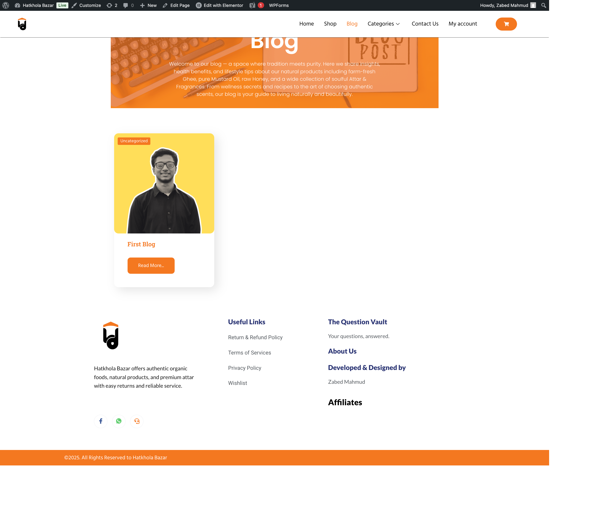

# Hatkhola Bazar – E-commerce Website  

## Overview  
Hatkhola Bazar is an online e-commerce platform owned by **Hatkhola Bazar** and designed & developed by me using **WordPress** and **WooCommerce**.  
This is my first live project, where I worked on creating a complete shopping experience with product categories, cart, checkout, local shipping, and responsive design.  

🔗 **Live Website:** [www.hatkholabazarbd.com](https://www.hatkholabazarbd.com)  

---

## Features  
- 🛒 E-commerce functionality with WooCommerce  
- 📦 Product categories & subcategories  
- 💳 Bangladeshi mobile payments (bKash, Nagad, Rocket, etc.)  
- 📱 Fully responsive design for mobile & desktop  
- 🚚 Pathao courier integration for local delivery  
- 🔍 Search & filter options for easy navigation  
- 🛡️ Return and refund policy integration  
- ⭐ Customer reviews & affiliate program support  

---

## Tech Stack  
- **WordPress** – CMS  
- **WooCommerce** – E-commerce plugin  
- **Elementor & Elementor Pro** – Page Builder  

---

## Plugins Used  

### 🛠️ Core Functionality  
- **WooCommerce** – Main e-commerce engine powering product listings, cart, checkout, and orders.  
- **Sequential Order Numbers for WooCommerce** – Generates sequential order numbers for better tracking.  
- **Shipping by City for WooCommerce** – Enables city-based shipping customization.  

### 📱 Payments & Courier  
- **Bangladeshi Payments Mobile** – Integrates local mobile payment gateways like bKash, Nagad, and Rocket.  
- **Pathao Courier** – Adds Pathao courier service for local deliveries.  

### 🎨 Design & UI  
- **Elementor & Elementor Pro** – Drag-and-drop page builders for professional layouts.  
- **ElementsKit Lite** – Adds extra widgets and features for Elementor.  
- **ShopEngine** – WooCommerce templates and design elements for Elementor.  
- **Widget Options** – Controls widget visibility and customization.  

### 📈 SEO, Reviews & Marketing  
- **Yoast SEO** – SEO optimization for better search engine visibility.  
- **WP Affiliate Manager** – Manages affiliate programs for product promotion.  
- **WP Ultimate Review** – Adds customer review and rating functionality.  

### 📋 Forms & Interaction  
- **WPForms Lite** – User-friendly form builder for contact and order forms.  

---

## Development Journey  
- Learned WordPress website design one year ago.  
- Worked for over a month to complete and polish this project.  
- This is my **first live project**, Alhamdulillah.  
- The site is still under improvement as I continue to refine features and user experience.  

---

## Website Preview  

  ### 1) Home Page  

  

### 2) Shop Page  

  

### 3) Blog Page  

  

  

---

## Future Improvements  
- 🔄 Improve site performance & speed optimization  
- 🌐 Add multilingual support  
- 📊 Integrate advanced analytics  
- 📱 Launch a mobile app version in future  

---

## Author  
👤 **Zabed Mahmud**  
- 💼 [LinkedIn](https://www.linkedin.com/in/zabedfolio/)  
- ✉️ Email: [zabedfolio@gmail.com](mailto:zabedfolio@gmail.com)  

---

## License  
This project is created for **educational and portfolio purposes**.  
The website itself is used for **business operations of Hatkhola Bazar**.  
